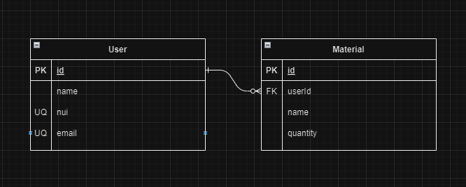

# Endpoints y modelo relacional TrashLess

## Modelo relacional

# Endpoints 

## User
### Para la tabla user tenemos los siguientes endpoints:
#### -localhost:3000/users (obtiene todos los users mediante el método GET).
#### -localhost:3000/users/{id} (obtiene los users por su id mediante el método GET).

## Material
### Para la tabla material tenemos los siguientes endpoints:
#### -localhost:3000/materials (obtiene todos los materials mediante el método GET).
#### -localhost:3000/materials/{id} (obtiene los materials por su id mediante el método GET).

## *Para la creación, eliminación y edición de users y materials se usó PostMan*
